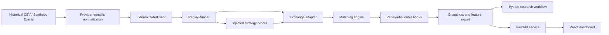

# Bookforge

Bookforge is a hybrid **C++20 + Python** market-microstructure platform for studying limit-order-book behavior under deterministic replayed market-event flow.

At its core is a price-time-priority C++20 matching engine with deterministic replay infrastructure, multi-symbol routing, snapshot and feature export, and replay-based execution experiments. The repository connects that systems layer to a Python research workflow for short-horizon modeling and a FastAPI + React inspection surface.

> **Portfolio scope:** Bookforge is an educational and research-oriented market replay platform. It is not a production exchange or a live trading system.

## Proof points

- **C++20 systems core:** Price-time-priority order book, matching engine, replay adapter boundary, explicit-ID lifecycle handling, and multi-symbol isolation.
- **Deterministic replay:** Normalized UTC epoch-nanosecond timestamps, bounded replays, optional event-time pacing, fixture-based regression coverage, and scheduled injected orders.
- **Research workflow:** Microstructure feature export, Python dataset/label utilities, XGBoost baseline tooling, chronological and walk-forward evaluation, optional SHAP analysis, and MLflow tracking.
- **Engineering workflow:** CMake, GoogleTest, Google Benchmark, pybind11, pytest, Ruff, Docker Compose, and GitHub Actions CI.
- **Performance baseline:** The synthetic Release-mode replay benchmark has measured roughly 4.4M–4.7M events/sec on a Windows development environment. See `docs/BENCHMARK.md` for the benchmark methodology and reproduce results locally before comparing environments.

## Verified results

| Area | Evidence |
|---|---|
| Correctness | 231/231 CTest tests passed locally, including replay, lifecycle, multi-symbol, snapshot, strategy, and CLI integration coverage |
| Symbol isolation | Feature export filters input events before replay so BTC features cannot include ETH liquidity |
| Replay throughput | 4.4788M events/s mean and 4.4843M events/s median on a deterministic 10,000-event in-memory fixture in a Release build |
| Order-book throughput | 3.2522M inserts/s and 5.5811M add/cancel operations/s at a 100,000-order workload scale |
| Research dataset | 2,166,109 BTC feature rows with 23 replay-derived microstructure features |
| Evaluation | Purged 50-event temporal baseline: 0.3535 macro F1 vs. 0.3324 for an always-flat baseline |

See [benchmark methodology](docs/BENCHMARK.md) and [experiment results](docs/EXPERIMENTS.md) for reproduction steps and limitations.

## Architecture



## Purpose

Bookforge combines **systems engineering** and **market-microstructure research** in one repository.

Many portfolio projects emphasize either:

- Machine learning without systems depth
- Systems code without a reproducible research workflow

Bookforge bridges those areas through:

- A replayable order-book and matching-engine core
- Reproducible snapshot and feature export
- A strategy-experiment framework for replay-based execution analysis
- A Python workflow for dataset construction, modeling, and evaluation
- An API/dashboard surface for inspection and demos

The project is designed to support discussion in:

- C++ and backend software engineering interviews
- Quantitative software engineering and market-data engineering interviews
- Market-microstructure research discussions
- ML engineering interviews where reproducible feature and validation workflows matter

## Highlights

- C++20 matching engine and price-time-priority order book
- Deterministic replay pipeline for external market-event playback
- Isolated matching-engine books for each replayed symbol
- Optional per-symbol replay filtering with deterministic sorted summaries
- Event-time replay pacing with a configurable speed multiplier
- Hyperliquid-style CSV ingestion for replay experiments
- UTC Unix epoch-nanosecond timestamp normalization with fractional precision
- Optional external-order-ID preservation for lifecycle-aware replay datasets
- Explicit-ID `New`, `Cancel`, `Fill`, and `Replace` handling
- FIFO preservation for same-price quantity reductions
- Requeue behavior for replayed price changes or quantity increases
- Snapshot export and comparison for reproducibility and checkpoint validation
- Feature export for spread, mid-price, depth imbalance, OFI, and rolling context
- Strategy-experiment runner with injected-order support and CSV result output
- Replay-time fill, decision-book, and implementation-shortfall metrics
- Python dataset and modeling tooling for short-horizon predictive baselines
- Chronological holdout, walk-forward evaluation, optional SHAP analysis, and MLflow tracking
- FastAPI backend and React/Vite dashboard for replay summaries and feature samples
- C++ and Python tests, benchmarks, formatting checks, and CI

## Core areas

### C++ core

The core systems layer includes:

- C++20 matching engine
- Price-time-priority order book
- Replay runner and replay-adapter architecture
- Independent matching-engine instances for symbol-bearing replay data
- Optional event-time pacing with deterministic requested-delay calculations
- Hyperliquid-style CSV reader for external order-event data
- Snapshot builder, serializer, deserializer, and comparator
- Feature-extraction pipeline
- Strategy-experiment configuration, injected-order helpers, adapters, runners, comparison support, and CSV writing
- GoogleTest coverage for core engine, replay, snapshots, features, and strategy experiments
- Google Benchmark coverage for order-book hot paths and replay throughput

### Multi-symbol replay

Bookforge routes symbol-bearing replay events to independent matching engines and adapters. This prevents orders from one instrument from interacting with liquidity in another instrument, even when prices overlap.

For a CSV with multiple symbols:

- Each symbol receives an isolated order book and matching engine
- Cross-symbol orders cannot create trades
- Final symbol summaries are printed in sorted symbol order
- `--symbol <symbol>` filters input before replay, so pacing, metrics, and final-book output apply only to the selected instrument
- CSV rows without a symbol route to the configured fallback symbol, currently `BTCUSDT.P`, preserving compatibility with legacy symbol-less files

### Replay pacing

Replay is **unpaced by default**, preserving fastest-possible event processing for benchmarks and normal test runs.

When event-time pacing is enabled, Bookforge calculates the non-negative timestamp delta between consecutive processed replay events and requests a scaled delay:

\[
\text{requested delay} =
\frac{\max(0,\ t_i - t_{i-1})}{\text{replay speed}}
\]

- The first processed event does not wait
- `start_offset` establishes a new first-event timing baseline
- Non-monotonic timestamps request no negative delay
- A positive speed multiplier accelerates replay; for example, `10` replays timestamp gaps at 10x speed
- Injected orders retain ordering around an external event: pacing, `BeforeEvent` orders, external event, then `AfterEvent` orders
- Requested replay delays are observable through replay latency-histogram metrics

### Strategy experiments

The strategy-experiment layer supports deterministic execution analysis over the replay pipeline.

It currently provides:

- Configurable strategy label: `passive` or `aggressive`
- Explicit comparison configurations against the same immutable replay-event vector and entry offset
- Configurable entry offset, side, limit price, quantity, and injection timing
- Injected-order fill linkage from matching-engine trades into experiment results
- Decision-time top-of-book capture immediately before injected-order submission
- CSV result export with a stable, tested schema
- Sign-aware implementation shortfall in basis points
- Replay-time first-fill and full-fill timing metrics
- A CLI for loading CSV events, filtering a symbol, running an experiment, and writing a result row

The current `mode` field is recorded as an experiment label. Whether an injected order rests or crosses available replayed liquidity is controlled by its configured side and limit price relative to the book. A distinct mode-specific execution-policy abstraction, such as market-order behavior or a schedule model, is future work.

The result schema includes:

- `requested_qty`, `filled_qty`, `remaining_qty`, and `fill_rate`
- `avg_execution_price`
- `decision_mid_price`, `decision_spread`, and `has_decision_metrics`
- `implementation_shortfall_bps`
- `time_to_first_fill_us` and `time_to_full_fill_us`

Time-to-fill metrics are measured in replay-time microseconds from injected-order submission to the first and full fills. Replay timestamps are normalized from source CSV values. A zero value means the order did not reach that fill milestone or the observed fill timestamp was not later than the injection timestamp; it does not represent live exchange latency.

### Python research layer

The Python layer includes:

- Feature CSV loading and validation
- Dataset-construction utilities
- Label generation
- Baseline XGBoost training
- Chronological holdout evaluation with configurable event-horizon purge
- Expanding-window walk-forward validation with configurable event-horizon purge
- Feature-importance export
- Optional SHAP analysis
- MLflow experiment tracking
- Pytest coverage for Python-side utilities and API behavior

### Demo layer

The demo layer includes:

- FastAPI service for replay inspection
- Replay-summary endpoint
- Feature-sample retrieval endpoint
- React dashboard charts for:
  - Spread
  - Mid-price
  - L1 bid/ask depth
  - Depth imbalance
- Docker Compose support for local demo startup

## Benchmarking

Bookforge includes a microbenchmark for order-book hot paths and a replay benchmark for end-to-end event processing.

The replay benchmark uses a larger deterministic synthetic CSV fixture so throughput results are less dominated by benchmark overhead. On one Windows development environment, the large fixture has measured roughly **4.4M–4.7M events/sec** in Release mode. This is a local baseline, not a cross-machine performance claim.

Run throughput benchmarks using default unpaced replay. Event-time pacing deliberately waits for source timestamp gaps and is therefore not a throughput benchmark mode.

```powershell
.\build\bench\Release\benchmark_replay.exe
```

```bash
./build/bench/benchmark_replay
```

See `docs/BENCHMARK.md` for methodology, fixture details, build configuration, and interpretation guidance.

## Why it matters

Bookforge is designed to demonstrate end-to-end engineering reasoning relevant to quant and market-data systems:

- Building a deterministic systems core
- Validating behavior with repeatable tests
- Separating source-specific parsing from internal engine semantics
- Exporting structured state for downstream analysis
- Building a research workflow around well-defined temporal validation
- Presenting replay outputs through an inspectable interface instead of raw files alone

In practice, the repository can be used to:

- Study replayed order-book behavior
- Prototype microstructure features
- Build short-horizon predictive datasets
- Evaluate modeling ideas with chronological discipline
- Develop replay-based execution-analysis experiments
- Present outputs through a lightweight API and dashboard

## Tech stack

### Core systems

- C++20
- CMake
- GoogleTest
- Google Benchmark
- clang-format

### Python and data tooling

- Python 3.11+
- pandas
- numpy
- scipy
- pybind11
- scikit-learn
- XGBoost
- SHAP
- MLflow
- pytest
- Ruff

### API and app layer

- FastAPI
- Pydantic
- Uvicorn
- React
- Vite
- Recharts
- Docker
- Docker Compose

## Repository structure

```text
Bookforge/
├── src/                  # C++ engine, replay, snapshot, feature, and experiment code
├── python/               # Python package, ML scripts, and FastAPI backend
├── dashboard/            # React + Vite frontend
├── tests/                # C++ and Python tests plus fixtures
├── data/                 # Sample and processed datasets
├── docs/                 # Architecture, benchmark, research, and project notes
├── output/               # Generated artifacts such as features and reports
├── bench/                # Google Benchmark targets
├── bindings/             # Python/C++ binding-related project files
└── tools/                # Fixture and synthetic-event generators
```

## Quick start

### 1. Clone the repository

```bash
git clone [https://github.com/dong-quan-tran/Bookforge.git](https://github.com/dong-quan-tran/Bookforge.git)
cd Bookforge
```

### 2. Create and activate a virtual environment

#### Windows PowerShell

```powershell
python -m venv .venv
.venv\Scripts\Activate.ps1
```

#### macOS and Linux

```bash
python3 -m venv .venv
source .venv/bin/activate
```

### 3. Install Python dependencies

```bash
pip install -r requirements.txt
```

### 4. Configure and build the C++ project

```bash
cmake -S . -B build
cmake --build build --config Debug
```

### 5. Run the C++ test suite

```bash
ctest --test-dir build -C Debug --output-on-failure
```

### 6. Run Python tests

#### Windows PowerShell

```powershell
$env:PYTHONPATH = "python"
python -m pytest tests/python -q
```

#### macOS and Linux

```bash
PYTHONPATH=python python -m pytest tests/python -q
```

## Usage

The repository includes `data/btc_orders_sample_2025-12-15-12.csv`, a 100,000-row Hyperliquid-style BTC order-status sample with this symbol-less schema:

```text
ts,limitPx,sz,isAsk,statusId
```

Bookforge routes symbol-less rows to fallback symbol `BTCUSDT.P`. The sample is useful for validating ingestion, replay CLI behavior, fallback routing, and experiment-result export. Its status-oriented events may not create active resting liquidity in the current replay adapter, so strategy experiments against this sample can complete with zero fills and unavailable decision-book metrics.

### Replay Hyperliquid-style CSV data

Bookforge parses `ts` values in the form `YYYY-MM-DD HH:MM:SS` with optional fractional seconds up to nanosecond precision. Timestamps are interpreted as UTC and normalized to Unix epoch nanoseconds. They preserve source ordering, drive optional replay pacing, and support replay-time strategy fill metrics.

#### Windows PowerShell

```powershell
.\build\Debug\hyperliquid_replay_main.exe data\btc_orders_sample_2025-12-15-12.csv
```

#### macOS and Linux

```bash
./build/hyperliquid_replay_main data/btc_orders_sample_2025-12-15-12.csv
```

When a CSV contains multiple symbols, replay prints a separate final-book summary for each symbol in sorted symbol order.

### Replay one symbol

Use `--symbol <symbol>` to replay one instrument from a symbol-bearing CSV.

#### Windows PowerShell

```powershell
.\build\Debug\hyperliquid_replay_main.exe data\btc_orders_sample_2025-12-15-12.csv --symbol BTCUSDT.P
```

#### macOS and Linux

```bash
./build/hyperliquid_replay_main data/btc_orders_sample_2025-12-15-12.csv --symbol BTCUSDT.P
```

The filter is applied before replay. Event-time pacing, replay metrics, trade counts, and final-book summaries therefore represent only the selected instrument.

For legacy CSV files without a symbol column, Bookforge uses fallback symbol `BTCUSDT.P`. The command above includes all rows from the checked-in BTC sample. A different symbol filter excludes those symbol-less rows.

### Replay with event-time pacing

By default, replay is unpaced and processes events as quickly as possible.

#### Windows PowerShell

```powershell
# Default fastest-possible replay.
.\build\Debug\hyperliquid_replay_main.exe data\btc_orders_sample_2025-12-15-12.csv --pacing unpaced

# Wait for recorded event-time gaps.
.\build\Debug\hyperliquid_replay_main.exe data\btc_orders_sample_2025-12-15-12.csv --pacing event-time

# Replay recorded timestamp gaps at 10x speed.
.\build\Debug\hyperliquid_replay_main.exe data\btc_orders_sample_2025-12-15-12.csv --pacing event-time --speed 10

# Select legacy symbol-less BTC rows and use event-time pacing.
.\build\Debug\hyperliquid_replay_main.exe data\btc_orders_sample_2025-12-15-12.csv --symbol BTCUSDT.P --pacing event-time
```

#### macOS and Linux

```bash
# Default fastest-possible replay.
./build/hyperliquid_replay_main data/btc_orders_sample_2025-12-15-12.csv --pacing unpaced

# Wait for recorded event-time gaps.
./build/hyperliquid_replay_main data/btc_orders_sample_2025-12-15-12.csv --pacing event-time

# Replay recorded timestamp gaps at 10x speed.
./build/hyperliquid_replay_main data/btc_orders_sample_2025-12-15-12.csv --pacing event-time --speed 10

# Select legacy symbol-less BTC rows and use event-time pacing.
./build/hyperliquid_replay_main data/btc_orders_sample_2025-12-15-12.csv --symbol BTCUSDT.P --pacing event-time
```

Supported replay options:

```text
[input_csv]
--symbol <symbol>
--pacing unpaced|event-time
--speed <positive-number>
```

### Optional external order IDs

For lifecycle-aware replay datasets, the CSV reader preserves an optional external order identifier when one of these headers is present:

```text
order_id
orderId
oid
```

The checked-in BTC status sample has no external-ID column, so parsed events retain an empty external ID. Bookforge does not infer order identity from price, size, timestamp, or side.

When a `New` event with an explicit external ID rests in the internal book, a later `Cancel` event with the same ID removes that resting order. Unknown IDs, repeated cancels, empty IDs, and orders that fully cross at submission are safe no-ops.

For explicit external fill linkage, lifecycle CSVs must also provide an executed-quantity column named `fill_size`, `fillSize`, or `fillSz`. Bookforge uses that value only for `Fill` events; it does not infer fill quantity from generic `sz`. Partial fills reduce the mapped resting order, while a fill equal to or greater than remaining quantity removes it.

For replay order amendments, Bookforge recognizes `replaced`, `replace`, `amended`, and `amend` statuses, plus status ID `6`. A same-price quantity reduction preserves FIFO queue position. A price change or quantity increase uses replacement semantics and loses queue priority.

### Export features from replay data

#### Windows PowerShell

```powershell
.\build\Debug\feature_export_main.exe --input data\btc_orders_sample_2025-12-15-12.csv --output output\features.csv --symbol BTCUSDT.P --snapshot-depth 10 --imbalance-depth 10 --ofi-depth 10 --rolling-window 50
```

#### macOS and Linux

```bash
./build/feature_export_main --input data/btc_orders_sample_2025-12-15-12.csv --output output/features.csv --symbol BTCUSDT.P --snapshot-depth 10 --imbalance-depth 10 --ofi-depth 10 --rolling-window 50
```

### Run a strategy experiment

The strategy-experiment executable reads Hyperliquid-style CSV events, applies an optional symbol filter, injects one configured order at the selected event offset, and writes a one-row CSV result with fill, decision-book, implementation-shortfall, and replay-time timing metrics.

`entry-offset` is zero-based and applies after any `--symbol` filtering.

#### Windows PowerShell

```powershell
.\build\Debug\strategy_experiment_main.exe `
    --input data\btc_orders_sample_2025-12-15-12.csv `
    --output output\strategy_experiment_results.csv `
    --symbol BTCUSDT.P `
    --mode aggressive `
    --side buy `
    --limit-price 100000 `
    --quantity 1 `
    --entry-offset 0
```

#### macOS and Linux

```bash
./build/strategy_experiment_main \
    --input data/btc_orders_sample_2025-12-15-12.csv \
    --output output/strategy_experiment_results.csv \
    --symbol BTCUSDT.P \
    --mode aggressive \
    --side buy \
    --limit-price 100000 \
    --quantity 1 \
    --entry-offset 0
```

Use `--symbol <symbol>` to isolate an experiment to one instrument in a multi-symbol CSV. If omitted, all events are replayed. For the checked-in symbol-less BTC sample, `--symbol BTCUSDT.P` includes all rows through fallback routing.

The configured `--limit-price` determines whether the injected order rests or crosses available liquidity.

Supported strategy-experiment options:

```text
--input <csv>
--output <csv>
--symbol <symbol>
--mode passive|aggressive
--side buy|sell
--limit-price <positive-number>
--quantity <positive-integer>
--entry-offset <zero-based-event-index>
```

### Multi-symbol fixture demo

The repository includes a small deterministic fixture:

```text
tests/fixtures/hyperliquid_multi_symbol_fixture.csv
```

It contains interleaved BTC and ETH `New` events with independent books. Replay all symbols:

```powershell
.\build\Debug\hyperliquid_replay_main.exe tests\fixtures\hyperliquid_multi_symbol_fixture.csv
```

Expected final top-of-book levels:

```text
BTCUSDT.P: best bid 99.0, best ask 100.0
ETHUSDT.P: best bid 89.0, best ask 90.0
```

Replay BTC only:

```powershell
.\build\Debug\hyperliquid_replay_main.exe tests\fixtures\hyperliquid_multi_symbol_fixture.csv --symbol BTCUSDT.P
```

Run a BTC experiment against only BTC liquidity:

```powershell
.\build\Debug\strategy_experiment_main.exe `
    --input tests\fixtures\hyperliquid_multi_symbol_fixture.csv `
    --output output\btc_fixture_experiment.csv `
    --symbol BTCUSDT.P `
    --mode aggressive `
    --side buy `
    --limit-price 101 `
    --quantity 2 `
    --entry-offset 1
```

The fixture demonstrates that BTC and ETH liquidity remain isolated. It is intended primarily for deterministic order-book and CLI regression coverage.

### Benchmark replay throughput

#### Windows PowerShell

```powershell
.\build\bench\Release\benchmark_replay.exe
```

#### macOS and Linux

```bash
./build/bench/benchmark_replay
```

### Train a baseline model

#### Windows PowerShell

```powershell
$env:PYTHONPATH = "python"
python python/ml/train.py --features-csv output\features.csv --label-type classification --horizon-events 50 --up-threshold 0.0 --down-threshold 0.0
```

#### macOS and Linux

```bash
PYTHONPATH=python python/ml/train.py --features-csv output/features.csv --label-type classification --horizon-events 50 --up-threshold 0.0 --down-threshold 0.0
```

### Run walk-forward evaluation with MLflow

#### Windows PowerShell

```powershell
$env:PYTHONPATH = "python"
$env:MLFLOW_TRACKING_URI = "sqlite:///mlruns.db"

python python/ml/train.py `
    --features-csv output\features.csv `
    --label-type classification `
    --horizon-events 50 `
    --up-threshold 0.0 `
    --down-threshold 0.0 `
    --validation walk_forward `
    --wf-initial-train-size 50000 `
    --wf-test-size 10000 `
    --wf-step-size 10000 `
    --wf-max-folds 5 `
    --enable-mlflow `
    --mlflow-experiment bookforge `
    --enable-shap `
    --shap-sample-size 2000
```

#### macOS and Linux

```bash
PYTHONPATH=python \
MLFLOW_TRACKING_URI=sqlite:///mlruns.db \
python python/ml/train.py \
    --features-csv output/features.csv \
    --label-type classification \
    --horizon-events 50 \
    --up-threshold 0.0 \
    --down-threshold 0.0 \
    --validation walk_forward \
    --wf-initial-train-size 50000 \
    --wf-test-size 10000 \
    --wf-step-size 10000 \
    --wf-max-folds 5 \
    --enable-mlflow \
    --mlflow-experiment bookforge \
    --enable-shap \
    --shap-sample-size 2000
```

### Launch the API

#### Windows PowerShell

```powershell
$env:PYTHONPATH = "python"
uvicorn api.main:app --reload --port 8010
```

#### macOS and Linux

```bash
PYTHONPATH=python uvicorn api.main:app --reload --port 8010
```

### Launch the dashboard

```bash
cd dashboard
npm install
npm run dev
```

### Run the local demo with Docker Compose

```bash
docker compose up --build
```

### Generate a replay fixture

#### Windows PowerShell

```powershell
python tools\generate_replay_fixture.py --events 10000 --base-price 100.00 --output tests\fixtures\hyperliquid_replay_fixture_large.csv
```

#### macOS and Linux

```bash
python tools/generate_replay_fixture.py --events 10000 --base-price 100.00 --output tests/fixtures/hyperliquid_replay_fixture_large.csv
```

### Generate synthetic market events

#### Windows PowerShell

```powershell
python tools\generate_synthetic_market_events.py `
    --events 10000 `
    --base-price 100000 `
    --tick-size 0.5 `
    --base-spread-ticks 2 `
    --min-size 0.001 `
    --max-size 0.05 `
    --seed 42 `
    --output data\synthetic_replay_fixture.csv
```

#### macOS and Linux

```bash
python tools/generate_synthetic_market_events.py \
    --events 10000 \
    --base-price 100000 \
    --tick-size 0.5 \
    --base-spread-ticks 2 \
    --min-size 0.001 \
    --max-size 0.05 \
    --seed 42 \
    --output data/synthetic_replay_fixture.csv
```

## Formatting and local checks

### Python

```bash
ruff check .
ruff format .
```

### C++

The repository uses a root `.clang-format` file and checks formatting in CI.

### Local development helper

For a one-command local check:

```powershell
.\scripts\dev-check.ps1
```

The helper formats C++ source, header, test, and benchmark files; configures and builds the C++ project; runs CTest; runs Ruff lint and formatting checks; runs Python tests; and compiles Python source files. By default, it disables benchmark target construction to keep routine validation fast.

The repository also uses `.gitattributes` to keep line endings consistent across platforms.

## Limitations

- Bookforge is educational and research-oriented; it is not a production trading system.
- The Hyperliquid replay path is an approximation of full exchange lifecycle behavior and depends on fields available in the source dataset.
- Stateful external cancel, fill, and replacement handling requires explicit external order IDs; Bookforge does not infer identity from price, size, timestamp, or side.
- Time-to-fill metrics are available for injected strategy orders when replay timestamps are present. They are replay-time measurements, not live exchange-latency measurements.
- Event-time pacing uses input event timestamps and wall-clock sleeping, so it is intended for controlled replay behavior rather than maximum throughput.
- The checked-in BTC order-status sample is symbol-less and may not generate active resting liquidity under the current event-status mapping.
- Strategy `mode` is currently an experiment label; execution behavior is primarily controlled by side and limit price.
- The baseline ML pipeline is intended for research. Label quality, class balance, data coverage, and out-of-sample performance require experiment-specific validation.

## Additional documentation

Detailed planning and implementation progress:

- `docs/BLUEPRINT.md`
- `docs/PROGRESS.md`

Architecture, data, snapshots, benchmarking, and interview notes:

- `docs/ARCHITECTURE.md`
- `docs/DATA_GUIDE.md`
- `docs/SNAPSHOT_SCHEMA.md`
- `docs/INTERVIEW_PREP.md`
- `docs/WEEK_BY_WEEK.md`
- `docs/BENCHMARK.md`
- `docs/adr/` — architecture decision records for major design choices

## Author

Bookforge is developed and maintained by:

- **Dong Quan Tran (Johnny)**
- Email: [dxt9721@mavs.uta.edu](mailto:dxt9721@mavs.uta.edu) / [dongquan.tran.johnny@gmail.com](mailto:dongquan.tran.johnny@gmail.com)
- GitHub: [dong-quan-tran](https://github.com/dong-quan-tran)
