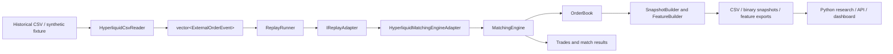
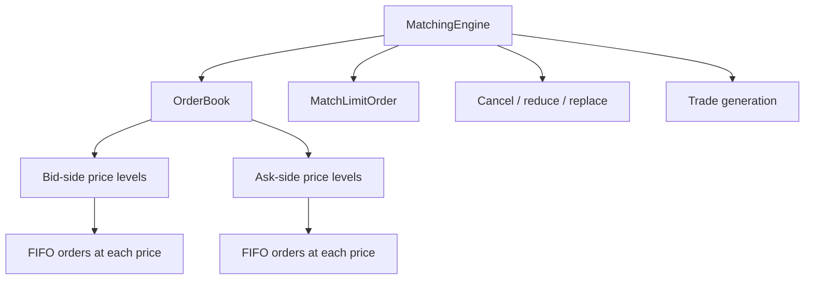

# Architecture

## Overview

Bookforge is a C++20 market-replay and limit-order-book system centered on a price-time-priority matching engine. Replay, snapshotting, feature extraction, execution experiments, benchmarks, Python bindings, and an API/dashboard layer are built around that core.

The primary design goal is **correctness and deterministic state transitions first**, with boundaries that support research workflows and performance measurement without placing provider-specific logic inside the matching engine.

The core is responsible for:

- Representing orders and price levels
- Maintaining bid and ask books
- Enforcing price-time priority
- Supporting add, cancel, execute, reduce, and replace operations
- Exposing top-of-book and depth queries
- Producing deterministic trade results for marketable limit orders

Around that core, the repository provides:

- CSV ingestion and provider-specific normalization
- Adapter-driven translation from external events to engine actions
- Deterministic replay with bounds, pacing, and injected-order scheduling
- Snapshot and feature extraction pipelines
- Strategy-experiment configuration, execution-quality accounting, and CSV output
- Benchmark targets for isolated operations and end-to-end replay
- Python bindings and downstream research tooling
- FastAPI and dashboard surfaces for inspecting exported outputs

## Architecture diagrams

### End-to-end replay pipeline



### Strategy-experiment pipeline

```mermaid
flowchart LR
    A[StrategyExperimentConfig] --> B[MakeInjectedOrder]
    B --> C[InjectedOrder]
    C --> D[InjectedOrderSchedule]

    E[ExternalOrderEvent vector] --> F[StrategyExperimentRunner]
    D --> F

    F --> G[ReplayRunner]
    G --> H[StrategyExperimentReplayAdapter]
    H --> I[HyperliquidMatchingEngineAdapter]
    I --> J[MatchingEngine]
    J --> K[Trade callbacks for injected order]
    K --> L[StrategyExperimentAdapter]
    L --> M[StrategyExperimentResult]
    M --> N[StrategyExperimentCsvWriter]
    N --> O[CSV experiment output]
```



### Core engine structure



### Replay control flow

```mermaid
flowchart TD
    A[ReplayConfig] --> B[ReplayRunner]
    C[ExternalOrderEvent vector] --> B
    D[InjectedOrderSchedule] --> B
    B --> E{Within configured bounds?}
    E -- No --> F[Stop replay]
    E -- Yes --> G[Optional event-time pacing]
    G --> H[Dispatch BeforeEvent injected orders]
    H --> I[adapter.OnEvent events[i]]
    I --> J[Dispatch AfterEvent injected orders]
    J --> K[Advance to next event]
    K --> E
```

## System pipeline

Bookforge is organized as narrow layers around the C++20 matching-engine core.

Typical replay data flow:

```text
CSV / synthetic data
  -> HyperliquidCsvReader
  -> ExternalOrderEvent
  -> ReplayRunner
  -> IReplayAdapter
  -> HyperliquidMatchingEngineAdapter
  -> MatchingEngine
  -> OrderBook
  -> trades / snapshots / features / metrics
```

Typical strategy-experiment data flow:

```text
StrategyExperimentConfig
  -> injected-order construction
  -> InjectedOrderSchedule
  -> ReplayRunner dispatch
  -> matching-engine trade callback
  -> StrategyExperimentAdapter
  -> StrategyExperimentResult
  -> CSV output
```

This separation keeps ingestion, replay orchestration, matching logic, experiment accounting, and output formatting independently testable.

## Core data structures

### Order

`Order` is the atomic unit stored by the book.

It represents:

- `id`: unique internal order identifier
- `participant_id`: owner or participant identity
- `side`: buy or sell
- `price`: limit price
- `quantity`: current remaining live quantity
- `timestamp`: arrival timestamp used for ordering and replay-time accounting
- Self-trade-prevention metadata where applicable

After a partial execution, `quantity` represents remaining quantity rather than original submitted quantity.

### PriceLevel

A `PriceLevel` groups all live orders resting at one exact price on one side of the book.

Responsibilities:

- Preserve FIFO order among resting orders at the same price
- Track aggregate resting quantity at that price
- Expose front-order execution behavior
- Remove itself when no live orders remain

Conceptually:

- Bid levels are prioritized by descending price
- Ask levels are prioritized by ascending price
- Within a price level, orders execute in FIFO order

### OrderBook

`OrderBook` owns two-sided market state:

- Bid price levels
- Ask price levels
- Order lookup and index structures

It exposes:

- Order insertion
- Cancellation by internal order ID
- Quantity reduction
- Replacement
- Top-order execution at a price level
- Best bid and best ask
- Mid-price and spread
- Depth snapshots and order lookup

## Matching priority rules

Bookforge follows price-time priority.

### Price priority

Execution priority is determined first by price:

- Higher bid prices have priority over lower bid prices
- Lower ask prices have priority over higher ask prices

An incoming marketable buy order matches the lowest available ask first. An incoming marketable sell order matches the highest available bid first.

### Time priority

At the same price, resting orders execute in arrival order.

Queue priority is preserved only when an operation does not create a materially new resting order. Replay lifecycle handling therefore distinguishes reductions from priority-resetting changes.

## Book invariants

The following invariants should hold after every mutating operation.

1. **Valid side ordering**
   - Bid levels are ordered from highest price to lowest price.
   - Ask levels are ordered from lowest price to highest price.

2. **FIFO within a price level**
   - Orders resting at the same price retain insertion order.
   - The oldest live order at that level executes first.

3. **Single live instance per order ID**
   - An internal order ID appears at most once in the live book.
   - Duplicate insertion fails without changing state.

4. **Aggregate quantity consistency**
   - Reported price-level quantity equals the sum of remaining quantities of the live orders at that level.

5. **Top-of-book consistency**
   - `best_bid` is the highest live bid when bids exist.
   - `best_ask` is the lowest live ask when asks exist.

6. **Empty-level cleanup**
   - A price level is removed after its final order is canceled or fully executed.

7. **Order lookup consistency**
   - Every order in the global order index exists in exactly one price-level queue.
   - Every order in a price-level queue is discoverable through the order index.

8. **No zero-quantity resting orders**
   - Every live resting order has strictly positive remaining quantity.

These invariants are the correctness contract for tests, replay logic, bindings, snapshots, and downstream analytics.

## Empty-book behavior

Missing liquidity is represented explicitly.

- If no bids exist, `best_bid` is unavailable.
- If no asks exist, `best_ask` is unavailable.
- If either side is empty, `mid_price` is unavailable.
- If either side is empty, `spread` is unavailable.

The book does not invent synthetic prices for one-sided or empty states.

## Ownership and lifecycle

Order ownership is intentionally explicit.

### Live lifetime

An order is live only when both conditions hold:

- It is reachable through the order lookup/index.
- It is present in exactly one resting queue at one price level.

### Removal

An order ceases to be live when it is:

- Canceled
- Fully executed
- Replaced by removal of its current resting state and insertion of a new resting instance

### Partial execution

For a partial execution:

- The logical order remains live.
- Only remaining quantity changes.
- Existing queue priority is preserved.

### Replace semantics

Replace behavior reflects whether queue priority should be preserved:

- A same-price quantity reduction preserves FIFO position.
- An unchanged same-price quantity is a no-op.
- A price change requeues the order and loses FIFO priority.
- A quantity increase requeues the order and loses FIFO priority.

This models the common distinction between reducing displayed size and materially changing an order’s execution priority.

## Replay and adapters

Replay is a first-class layer rather than a feature embedded in the matching engine.

### ExternalOrderEvent

`ExternalOrderEvent` is the provider-neutral event model between raw input and replay adapters.

It carries normalized fields required by the replay path, including:

- Source timestamp
- Symbol when available
- Side, price, and quantity
- Event type
- Optional external order ID
- Optional explicit fill quantity

Provider-specific field names and status labels are normalized before the event reaches the matching engine.

### HyperliquidCsvReader

`HyperliquidCsvReader` loads Hyperliquid-style CSV data into `ExternalOrderEvent` records.

It is responsible for:

- Parsing expected CSV fields
- Tolerating a UTF-8 BOM before a header
- Mapping status fields to external event types
- Preserving optional external IDs from `order_id`, `orderId`, or `oid`
- Preserving optional explicit fill size from `fill_size`, `fillSize`, or `fillSz`
- Parsing timestamps as UTC Unix epoch nanoseconds, with optional fractional precision through nanoseconds
- Reporting malformed records through strict or non-strict error-handling modes

The reader remains separate from the matching engine so fixtures, tests, benchmarks, feature export, and experiments share one input normalization path.

### ReplayRunner

`ReplayRunner` owns deterministic event iteration and injected-order dispatch.

It supports:

- `start_offset` for skipping an initial event prefix
- `max_events` for bounded replay
- Progress and summary logging controls
- Unpaced replay for maximum throughput
- Event-time pacing using scaled non-negative deltas between consecutive processed event timestamps
- Dispatching scheduled injected orders immediately before or after a configured replay event
- Assigning the current event’s replay timestamp to dispatched injected orders

Pacing does not change event ordering. The ordering for a processed event is:

```text
optional pacing
-> BeforeEvent injected orders
-> external event
-> AfterEvent injected orders
```

### IReplayAdapter

`IReplayAdapter` decouples replay orchestration from a particular destination.

The interface receives:

- External replay events through `OnEvent`
- Scheduled injected orders through `OnInjectedOrder`
- Adapter metrics through `Metrics`

This allows the same `ReplayRunner` to drive matching-engine adapters, strategy experiments, recording adapters, and future replay consumers.

### HyperliquidMatchingEngineAdapter

`HyperliquidMatchingEngineAdapter` converts normalized external events into matching-engine actions while keeping provider-specific semantics out of the core.

For supported lifecycle data:

- `New` submits a passive limit order to the engine.
- A resting external order with an explicit external ID is mapped to its generated internal ID.
- `Cancel` removes the mapped resting order when the external ID is present and known.
- `Fill` reduces or removes the mapped resting order when both external ID and explicit fill size are available.
- `Replace` preserves FIFO for a same-price quantity reduction and requeues for price changes or quantity increases.
- `Reject`, `Trigger`, and unsupported/incomplete events are tracked through adapter metrics without corrupting book state.

The adapter does not infer order identity from price, size, timestamp, or side. Events lacking the explicit fields required for stateful linkage are tracked as unsupported or ignored as appropriate.

### Multi-symbol replay

Symbol-bearing input is routed to isolated matching engines and adapters.

This provides:

- One independent order book per symbol
- No cross-symbol matching
- Deterministic sorted summaries
- Optional pre-replay symbol filtering
- Legacy fallback routing for symbol-less CSV rows

## Strategy experiments

The strategy-experiment subsystem evaluates a scheduled injected limit order against replayed liquidity.

### StrategyExperimentConfig

`StrategyExperimentConfig` defines one experiment:

- `mode`: passive or aggressive experiment label
- `csv_path`: source replay CSV path
- `entry_offset`: replay position at which to inject
- `is_buy`: buy or sell side
- `limit_price`: injected limit price
- `quantity`: requested quantity
- `timing`: placement relative to the selected event

The current `mode` field is recorded as experiment metadata. Whether an injected order rests or crosses available liquidity is determined by side and limit price relative to book state. A distinct mode-specific execution-policy abstraction is future work.

### Injected orders and schedules

`MakeInjectedOrder` converts configuration into an `InjectedOrder`.

`MakeSingleOrderSchedule` places that order in an `InjectedOrderSchedule`, creating a clean boundary between experiment definition and replay-time dispatch.

The schedule abstraction supports future extensions without changing the replay loop, including:

- Multi-order schedules
- Scheduled cancel/replace behavior
- Latency models
- State-machine strategies
- Participation or execution schedules

### StrategyExperimentRunner

`StrategyExperimentRunner` coordinates a single run.

It:

- Creates a fresh matching engine and matching adapter
- Constructs an experiment adapter
- Schedules the configured injected order
- Replays the immutable event vector through `ReplayRunner`
- Links matching-engine trades involving the injected order back to experiment accounting
- Returns one `StrategyExperimentResult`

The runner coordinates components without duplicating matching or output formatting logic.

### StrategyExperimentAdapter

`StrategyExperimentAdapter` owns result accounting at the boundary between replay execution and experiment reporting.

It:

- Initializes result state from experiment configuration
- Captures top-of-book state immediately before the target injected order is submitted
- Records the injection timestamp assigned by replay dispatch
- Receives injected-order trade callbacks
- Accumulates filled quantity and remaining quantity
- Calculates weighted average execution price
- Records replay-time first-fill and full-fill latency
- Derives fill rate and sign-aware implementation shortfall
- Returns a stable result copy

### StrategyExperimentResult

`StrategyExperimentResult` is the stable output schema for one experiment.

It includes:

- Configuration: `mode`, `entry_offset`, `is_buy`, `limit_price`
- Quantity: `requested_qty`, `filled_qty`, `remaining_qty`
- Execution quality: `fill_rate`, `avg_execution_price`
- Decision state: `decision_best_bid`, `decision_best_ask`, `decision_mid_price`, `decision_spread`, `has_decision_metrics`
- Cost: `implementation_shortfall_bps`
- Timing: `time_to_first_fill_us`, `time_to_full_fill_us`

Timing is measured from injected-order submission to the corresponding fill milestone using normalized replay timestamps. It is replay-time accounting, not live exchange-latency measurement.

### Experiment outputs

`StrategyExperimentCsvWriter` serializes result records into stable row-oriented CSV output.

`StrategyExperimentSink` and `StrategyExperimentCsvSink` provide an additional output abstraction so future destinations—such as a database, dashboard, or event stream—can be added without coupling strategy execution to one storage format.

### Current experiment limitations

The experiment layer intentionally does not claim to model information it does not observe.

Current limits include:

- No source-derived queue-position reconstruction
- No source-derived queue-ahead volume
- No explicit venue latency, network latency, or exchange matching delay model
- No strategy-specific market-order or execution-schedule policy beyond injected limit-order configuration
- Dependence on source data containing enough lifecycle detail to reconstruct resting liquidity faithfully

## Derived market state

The book exposes derived values:

- **Best bid:** highest live bid price
- **Best ask:** lowest live ask price
- **Mid-price:** \((best\_bid + best\_ask) / 2\)
- **Spread:** \(best\_ask - best\_bid\)

Mid-price and spread are available only when both sides are populated.

## Snapshots and features

Snapshot and feature components consume state derived from the replay and matching-engine path.

### Snapshots

Snapshot components capture book state for:

- Reproducibility
- Checkpoint validation
- Regression tests
- CSV and binary downstream artifacts

The snapshot builder, serializers, deserializers, and comparator remain outside matching logic so persistence concerns do not complicate book operations.

### Features

The feature pipeline exports market-microstructure features including:

- Spread
- Mid-price
- Bid and ask depth
- Depth imbalance
- Order-flow imbalance
- Rolling liquidity and volatility context

Feature generation is downstream of replay and book reconstruction so all consumers share one authoritative market-state implementation.

## Benchmarks

Bookforge includes focused benchmarks and replay throughput benchmarks.

### benchmark_order_book

`benchmark_order_book` measures hot-path operations such as:

- Add order
- Cancel order
- Execute top order
- Reduce quantity
- Replace at same price
- Replace at new price

These measurements are used to detect performance regressions, not to make exchange-grade latency claims.

### benchmark_replay

`benchmark_replay` measures end-to-end replay throughput over a loaded synthetic fixture through the CSV reader, replay runner, and adapter stack.

The fixture is intentionally larger than a smoke test so results are less dominated by setup overhead. Benchmark interpretation, host details, build configuration, and methodology belong in `docs/BENCHMARKS.md`.

## Python bindings and research

The Python extension is a thin interface over selected C++ core functionality.

The design keeps matching, replay, and performance-sensitive state transitions in C++, while exposing outputs and selected controls to Python for:

- Scripting
- Dataset construction
- Feature analysis
- Modeling experiments
- API-facing workflows

Python does not duplicate matching semantics. The C++ implementation remains the authoritative source of book and replay behavior.

## Engineering controls

Bookforge includes controls intended to keep changes reproducible and cross-platform.

Current controls include:

- GitHub Actions CI using an Ubuntu Release build
- CMake build targets for libraries, executables, tests, bindings, and optional benchmarks
- GoogleTest discovery through CTest
- `clang-format` enforcement for C++ source, header, test, and benchmark files
- Ruff linting and formatting checks for Python
- Pytest coverage for Python utilities and API behavior
- Python source compilation checks
- `.gitattributes` line-ending normalization
- A PowerShell development helper that formats C++, builds, runs CTest, runs Ruff, runs pytest, and compiles Python sources
- Optional benchmark construction for deliberate local performance runs

Functional changes should include focused tests before integration-level changes. Formatting-only changes should be isolated from functional changes where practical.

## Why this structure

This architecture supports:

- Deterministic testing
- Realistic price-time-priority state transitions
- Clean provider-specific replay integration
- Explicit handling of incomplete external lifecycle data
- Feature extraction from one authoritative book-state path
- Incremental execution-experiment development without contaminating core matching logic
- Benchmark-driven regression tracking
- Python-based research without moving performance-sensitive logic out of C++
- Clear tradeoff discussion in systems, quant SWE, and ML engineering interviews
