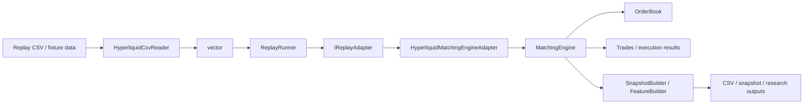
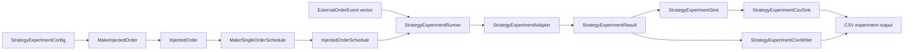
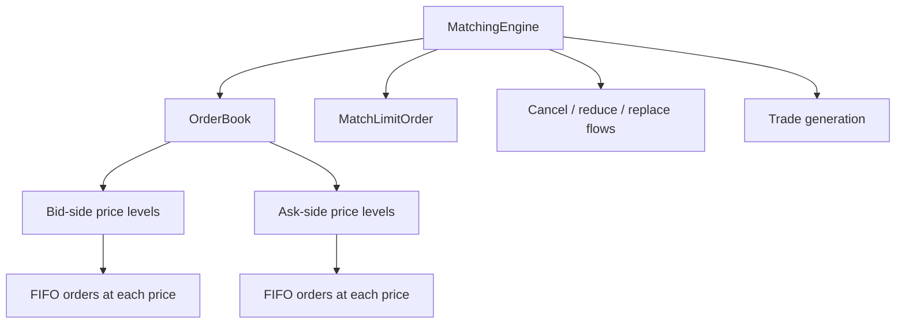

# Architecture

## Overview

Bookforge is a C++20 limit-order-book system centered on a price-time-priority matching engine, with replay, feature extraction, strategy-experiment tooling, benchmarking, and Python bindings layered around the core.

The core is responsible for:

- Representing orders and price levels
- Maintaining bid and ask books
- Enforcing price-time priority
- Supporting add, cancel, execute, reduce, and replace operations
- Exposing top-of-book and depth queries

Around that core, the repository adds:

- Replay ingestion from external CSV data
- Adapter-driven event translation into the matching engine
- Snapshot and feature extraction pipelines
- Strategy-experiment configuration, injected-order scheduling, result collection, and CSV output
- Benchmark targets for isolated operations and end-to-end replay
- Python bindings for scripting and downstream tooling

The design goal is correctness first, with a structure that also supports replay, feature extraction, execution experiments, benchmarking, and Python interop.

## Architecture diagrams

### End-to-end replay pipeline



### Strategy-experiment pipeline



### Core engine structure



### Replay control flow

```mermaid
flowchart TD
    A[ReplayConfig] --> B[ReplayRunner]
    C[Event vector] --> B
    B --> D{Within bounds?}
    D -- Yes --> E[adapter.OnEvent(events[i])]
    D -- No --> F[Stop replay]
    E --> G[Update metrics / counters]
    G --> H[Next event]
    H --> D
```

## System pipeline

Bookforge is organized as a set of narrow layers around a C++20 matching-engine core.

Typical replay data flow:

```text
CSV / replay data
  -> HyperliquidCsvReader
  -> ReplayRunner
  -> IReplayAdapter
  -> HyperliquidMatchingEngineAdapter
  -> MatchingEngine
  -> OrderBook
  -> snapshots / features / metrics / benchmarks
```

Typical strategy-experiment data flow:

```text
StrategyExperimentConfig
  -> injected-order construction and scheduling
  -> StrategyExperimentRunner
  -> StrategyExperimentAdapter
  -> StrategyExperimentResult
  -> CSV writer and/or experiment sink
  -> experiment output
```

This separation keeps data ingestion, replay orchestration, matching logic, experiment configuration, and output formatting independent and testable.

## Core data structures

### Order

`Order` is the atomic unit stored by the book.

It represents:

- `id`: unique order identifier
- `participant_id`: owner or participant identity
- `side`: buy or sell
- `price`: limit price
- `quantity`: remaining live quantity
- `timestamp`: arrival time used for priority
- Self-trade-prevention policy metadata where applicable

An `Order` represents the current remaining quantity, not the original submitted quantity, once partial executions begin.

### PriceLevel

A `PriceLevel` groups all live orders resting at one exact price on one side of the book.

Responsibilities:

- Preserve FIFO order among resting orders at the same price
- Track aggregate quantity at that price
- Expose front-order execution behavior
- Support removal when the level becomes empty

Conceptually:

- Bid levels compete by price descending
- Ask levels compete by price ascending
- Within one level, queue order is strictly time ordered

### OrderBook

`OrderBook` owns the two-sided market state:

- Bids
- Asks
- Order lookup and index structures

It exposes:

- Order insertion
- Cancellation by order ID
- Quantity reduction
- Replacement
- Top-order execution at a price level
- Best bid and best ask
- Mid-price and spread
- Depth snapshots

## Matching priority rules

Bookforge follows price-time priority, the standard matching rule for a modern limit-order book.

### Price priority

Execution priority is determined first by price:

- For bids, higher prices have priority over lower prices
- For asks, lower prices have priority over higher prices

An incoming marketable buy order matches the lowest available ask first. An incoming marketable sell order matches the highest available bid first.

### Time priority

When multiple resting orders exist at the same price, they execute in arrival order: first in, first out.

Any operation that effectively replaces an order should be treated as a loss of queue priority unless explicitly designed otherwise.

## Book invariants

The following invariants should hold after every mutating operation.

1. **Side ordering is valid**
   - Bid levels are ordered from highest price to lowest price.
   - Ask levels are ordered from lowest price to highest price.

2. **FIFO within a price level**
   - Orders resting at the same price retain insertion order.
   - The oldest live order at that level executes first.

3. **Single live instance per order ID**
   - An order ID may appear at most once in the live book.
   - Duplicate insertion must fail without changing state.

4. **Aggregate quantity consistency**
   - The quantity reported for a price level equals the sum of remaining quantities of all live orders in that level.

5. **Top-of-book consistency**
   - `best_bid` is the highest live bid if bids exist.
   - `best_ask` is the lowest live ask if asks exist.

6. **Empty-level cleanup**
   - If the final order at a price level is canceled or fully executed, that level is removed from its side map.

7. **Order lookup consistency**
   - Every live order reachable through the global order index exists in exactly one price-level queue.
   - Every order in a price-level queue is discoverable through the global order index.

8. **No zero-quantity resting orders**
   - A live order in the book must have strictly positive remaining quantity.

These invariants form the core correctness contract for tests, replay logic, bindings, and downstream analytics.

## Empty book behavior

The book handles missing liquidity explicitly.

Rules:

- If no bids exist, `best_bid` is unavailable
- If no asks exist, `best_ask` is unavailable
- If either side is empty, `mid_price` is unavailable
- If either side is empty, `spread` is unavailable

This avoids inventing synthetic prices and keeps analytics behavior explicit.

## Ownership and lifetime rules

Order ownership is intentionally simple and explicit.

### Live lifetime

An order is live only if:

- It exists in the order lookup or index
- It is present in exactly one resting queue at one price level

### Removal rules

An order stops being live when:

- It is canceled
- It is fully executed
- It is replaced by removing the old state and inserting a new resting instance

### Partial execution rules

If an order is partially executed:

- The same logical order remains live
- Only its remaining quantity changes
- Queue priority is preserved unless the operation is a replace

### Replace rules

A replace operation uses cancel-and-reinsert semantics for priority:

- Changing price loses priority
- Replacing at the same price also loses priority in the current design
- The replaced order no longer occupies its prior queue position

## Replay and adapters

Replay support is a first-class part of the architecture.

### HyperliquidCsvReader

`HyperliquidCsvReader` loads external event data from CSV into `ExternalOrderEvent` records. It is separate from the matching engine so replay fixtures, tests, benchmarks, feature export, and strategy experiments can share one input layer.

### ReplayRunner

`ReplayRunner` owns event iteration and replay control. It supports configurable replay bounds and logging controls, including:

- `start_offset` for skipping the first N events
- `max_events` for bounding replay length
- Progress and summary logging controls

### IReplayAdapter

`IReplayAdapter` decouples replay input from book execution. This allows the same replay driver to target the matching engine, metrics collection, or future alternative sinks without changing replay orchestration.

### HyperliquidMatchingEngineAdapter

`HyperliquidMatchingEngineAdapter` translates external events into matching-engine actions. New-order events are submitted into the book, while other event types are tracked for replay accounting and adapter metrics.

This keeps exchange-specific input semantics out of the core matching engine.

## Strategy experiments

The strategy-experiment subsystem is an incremental execution-analysis layer built around the replay architecture.

Its purpose is to make it possible to define an injected order, replay historical event flow, and collect a consistent result record suitable for comparing strategy configurations.

### StrategyExperimentConfig

`StrategyExperimentConfig` defines a single experiment run.

It includes:

- `mode`: passive or aggressive
- `csv_path`: source replay CSV path
- `entry_offset`: replay position at which the experiment should enter
- `is_buy`: buy or sell side
- `limit_price`: limit price for the injected order
- `quantity`: requested order quantity
- `timing`: placement relative to an event, using `InjectedOrderTiming`

### Injected orders and schedules

`MakeInjectedOrder` converts an experiment configuration into an `InjectedOrder`.

`MakeSingleOrderSchedule` wraps that order in an `InjectedOrderSchedule`, which provides an explicit boundary between experiment definition and replay-time order injection.

This design leaves room for future multi-order schedules, cancellations, amendments, latency models, and strategy state machines without requiring changes to the base replay loop.

### StrategyExperimentRunner

`StrategyExperimentRunner` coordinates an individual experiment run.

Its responsibilities are to:

- Receive replay configuration and experiment configuration
- Construct the experiment adapter
- Feed replay events through the adapter
- Return a `StrategyExperimentResult`

The runner is intentionally narrow. It should coordinate the experiment without duplicating matching-engine behavior or formatting output.

### StrategyExperimentAdapter

`StrategyExperimentAdapter` implements the replay-adapter boundary for an experiment.

It currently:

- Initializes a result record from experiment configuration
- Receives replay events through `OnEvent`
- Receives injected-order callbacks through `OnInjectedOrder`
- Tracks adapter metrics
- Captures the presence of decision-time metrics during replay
- Provides an `OnFill` hook for future matching-engine fill linkage
- Returns a copy of the current `StrategyExperimentResult`

The adapter is the correct location for execution-quality accounting because it sits at the boundary between replay behavior and experiment reporting.

### StrategyExperimentResult

`StrategyExperimentResult` is the stable output schema for one experiment.

It contains:

- Strategy configuration fields: `mode`, `entry_offset`, `is_buy`, and `limit_price`
- Quantity fields: `requested_qty`, `filled_qty`, and `remaining_qty`
- Fill-quality fields: `fill_rate` and `avg_execution_price`
- Decision-time fields: `decision_mid_price`, `decision_spread`, and `has_decision_metrics`
- Cost field: `implementation_shortfall_bps`
- Timing fields: `time_to_first_fill_us` and `time_to_full_fill_us`

The schema is designed so output consumers can compare passive and aggressive runs without depending on replay internals.

### Experiment outputs

`StrategyExperimentCsvWriter` serializes one or more result records to CSV.

The writer produces a stable row-oriented output that includes strategy mode, side, fill state, decision metrics, shortfall, and time-to-fill fields. CSV output is intentionally separate from experiment execution so analysis tooling can evolve independently from replay and matching behavior.

`StrategyExperimentSink` and `StrategyExperimentCsvSink` provide an additional output abstraction for experiment results. This allows future output destinations, such as databases, dashboards, or structured event streams, without coupling the runner or adapter to one storage format.

### Current limitations

The strategy-experiment subsystem is deliberately incomplete rather than pretending to model execution it does not yet observe.

The current architecture provides tested configuration, scheduling, runner, adapter, result, CSV writer, and sink boundaries. The following areas are still evolving:

- Linking actual matching-engine fills back to the injected order
- Capturing real decision-time mid-price and spread from book state
- Calculating timestamp-based time-to-first-fill and time-to-full-fill
- Computing sign-aware implementation shortfall from decision and execution prices
- Modeling queue position, latency, partial fills, cancellations, and exchange-specific lifecycle details

These limitations are explicit so experiment output is interpreted as scaffolding until full fill linkage is implemented.

## Derived market state

The book exposes several derived values:

- **Best bid**: highest live bid price
- **Best ask**: lowest live ask price
- **Mid-price**: `(best_bid + best_ask) / 2`
- **Spread**: `best_ask - best_bid`

These values are defined only when both sides of the book are non-empty.

## Feature extraction and snapshots

Feature and snapshot components consume state derived from the replay and matching-engine path.

### Snapshots

Snapshot components capture book state for:

- Reproducibility
- Checkpoint validation
- Regression testing
- Binary or serialized downstream artifacts

The snapshot builder, serializers, deserializers, and comparator are separate from the matching engine so persistence concerns do not complicate matching logic.

### Features

The feature pipeline exports market-microstructure features including:

- Spread
- Mid-price
- Bid and ask depth
- Depth imbalance
- Order-flow imbalance
- Rolling feature variants

Feature generation is downstream of replay and book-state reconstruction. This preserves one authoritative matching and book-state implementation.

## Benchmarking

Bookforge includes benchmark targets for isolated operations and replay throughput.

### benchmark_order_book

`benchmark_order_book` measures focused matching-engine operations such as:

- Add order
- Cancel order
- Execute top order
- Reduce quantity
- Replace at same price
- Replace at new price

This benchmark is intended to catch regressions in order-book hot paths.

### benchmark_replay

`benchmark_replay` measures replay throughput over a loaded fixture using the CSV reader, replay runner, and replay adapter stack.

The replay benchmark uses a larger synthetic fixture so measurements are less dominated by benchmark setup overhead and better represent end-to-end event processing.

## Python bindings

The Python extension is a thin interface over the C++ core.

The design goal is to keep matching, replay, and performance-sensitive logic in C++, while exposing selected functionality to Python for:

- Scripting
- Experiments
- Analysis workflows
- Downstream tooling

The C++ implementation remains the authoritative source of behavior. Python bindings should expose functionality rather than duplicate matching logic.

## Engineering controls

The repository includes engineering controls intended to keep the project maintainable and CI-friendly.

Current controls include:

- GitHub Actions CI
- `clang-format` enforcement for C++ sources
- Python linting and formatting checks
- CMake target wiring for tests and executables
- `.gitattributes` handling for line-ending consistency
- A PowerShell development helper that formats selected files, builds, and runs tests

These controls support the broader goal of moving the repository from "works" to "serious project."

## Development workflow controls

The repository uses workflow controls to keep CI and local development aligned:

- `.gitattributes` normalizes line endings so Git does not introduce noisy CRLF/LF diffs.
- C++ formatting is enforced with `clang-format` and should be run locally before commit.
- Formatting changes are best committed separately from functional changes.
- The local development helper can run formatting, build, and tests in one step.
- New replay, experiment, or output behavior should be covered by focused GoogleTest cases before integration-level changes.

These controls reduce repeated lint failures and keep the repository easier to review across Windows and Unix environments.

## Why this structure

This design is a good fit for Bookforge because it supports:

- Deterministic testing
- Realistic price-time-priority behavior
- Clean replay integration
- Feature extraction such as spread, imbalance, and order-flow metrics
- Incremental execution-experiment development without contaminating core matching logic
- Benchmark-driven performance tracking
- Python-based experimentation without moving core logic out of C++

It is also interview-friendly because the invariants, boundaries, and trade-offs can be explained clearly without hiding behind framework complexity.