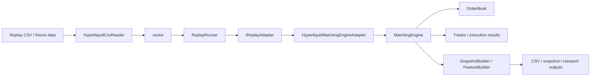

# Architecture

## Overview

Bookforge is a C++20 limit-order-book system centered on a price-time priority matching engine, with replay, benchmarking, and Python bindings layered around the core.

The core is responsible for:
- representing orders and price levels,
- maintaining bid and ask books,
- enforcing price-time priority,
- supporting add / cancel / execute / replace style operations,
- exposing top-of-book and depth queries.

Around that core, the repository adds:
- replay ingestion from external CSV data,
- adapter-driven event translation into the matching engine,
- benchmark targets for isolated operations and end-to-end replay,
- Python bindings for scripting and downstream tooling.

The design goal is correctness first, with a structure that also supports replay, feature extraction, benchmarking, and Python interop.

## Architecture diagrams

### End-to-end replay pipeline



### Core engine structure


### Replay control flow

```mermaid
flowchart TD
    A[ReplayConfig] --> B[ReplayRunner]
    C[Event vector] --> B
    B --> D{Within bounds?}
    D -- Yes --> E[adapter.OnEvent(events[i])]
    D -- No --> F[Stop replay]
    E --> G[Update metrics / counters]
    G --> H[Next event]
    H --> D
```

## System pipeline

Bookforge is organized as a small pipeline around a C++20 matching-engine core.

Typical data flow:

`CSV / replay data -> HyperliquidCsvReader -> ReplayRunner -> IReplayAdapter -> HyperliquidMatchingEngineAdapter -> MatchingEngine -> snapshots / metrics / benchmarks`

This structure keeps data ingestion, replay orchestration, and matching logic separate while still making the full system straightforward to test and benchmark.

## Core data structures

### Order

`Order` is the atomic unit stored by the book.

It represents:
- `id`: unique order identifier,
- `participant_id`: owner / participant identity,
- `side`: buy or sell,
- `price`: limit price,
- `quantity`: remaining live quantity,
- `timestamp`: arrival time used for priority,
- `self-trade-prevention`: optional STP policy metadata.

An `Order` should always represent the current remaining quantity, not the original submitted quantity, once partial executions begin.

### PriceLevel

A `PriceLevel` groups all live orders resting at one exact price on one side of the book.

Responsibilities:
- preserve FIFO order among resting orders at the same price,
- track aggregate quantity at that price,
- expose front-order execution behavior,
- support removal when the level becomes empty.

Conceptually:
- bid levels compete by price descending,
- ask levels compete by price ascending,
- inside one level, queue order is strictly time ordered.

### OrderBook

`OrderBook` owns the two-sided market state:
- bids,
- asks,
- order lookup / index structures.

It exposes:
- order insertion,
- cancellation by order id,
- quantity reduction,
- replacement,
- top-order execution at a price level,
- best bid / best ask,
- mid-price / spread,
- depth snapshots.

## Matching priority rules

Bookforge follows price-time priority, which is the standard matching rule for a modern limit order book.

### Price priority

Execution priority is determined first by price:
- for bids, higher prices have priority over lower prices,
- for asks, lower prices have priority over higher prices.

This means an incoming marketable buy order matches the lowest available ask first, while an incoming marketable sell order matches the highest available bid first.

### Time priority

When multiple resting orders exist at the same price, they are executed in arrival order, first in first out.

Any operation that effectively replaces an order should be treated as a loss of queue priority unless explicitly designed otherwise.

## Book invariants

The following invariants should always hold after every mutating operation:

1. **Side ordering is valid**
   - Bid levels are ordered from highest price to lowest price.
   - Ask levels are ordered from lowest price to highest price.

2. **FIFO within a price level**
   - Orders resting at the same price retain insertion order.
   - The oldest live order at that level is executed first.

3. **Single live instance per order id**
   - An order id may appear at most once in the live book.
   - Duplicate insertion must fail without changing state.

4. **Aggregate quantity consistency**
   - The total quantity reported for a price level equals the sum of remaining quantities of all live orders in that level.

5. **Top-of-book consistency**
   - `best_bid` is the highest live bid if any bids exist.
   - `best_ask` is the lowest live ask if any asks exist.

6. **Empty-level cleanup**
   - If the final order at a price level is canceled or fully executed, that level is removed from the side map.

7. **Order lookup consistency**
   - Every live order reachable through the global order index must also exist in exactly one price-level queue.
   - Every order in a price-level queue must be discoverable through the global order index.

8. **No zero-quantity resting orders**
   - A live order in the book must have strictly positive remaining quantity.

These invariants are the core correctness contract for tests, replay logic, and Python bindings.

## Empty book behavior

The book must handle missing liquidity explicitly.

Rules:
- if no bids exist, `best_bid` is unavailable,
- if no asks exist, `best_ask` is unavailable,
- if either side is empty, `mid_price` is unavailable,
- if either side is empty, `spread` is unavailable.

This avoids inventing synthetic prices and keeps analytics behavior explicit.

## Ownership and lifetime rules

Order ownership should be simple and explicit.

### Live lifetime

An order is considered live only if:
- it exists in the order lookup / index, and
- it is present in exactly one resting queue at one price level.

### Removal rules

An order stops being live when:
- it is canceled,
- it is fully executed,
- it is replaced by removing the old state and inserting a new resting instance.

### Partial execution rules

If an order is partially executed:
- the same logical order remains live,
- only its remaining quantity changes,
- its queue priority is preserved unless the operation is a replace.

### Replace rules

A replace operation should be treated as cancel-and-reinsert semantics for priority:
- changing price loses priority,
- replacing at the same price also loses priority in the current design,
- the replaced order should no longer occupy its previous queue position.

## Replay and adapters

Replay support is a first-class part of the architecture.

### HyperliquidCsvReader

`HyperliquidCsvReader` loads external event data from CSV into `ExternalOrderEvent` records. It is intentionally separate from the matching engine so that replay fixtures, tests, and benchmarks can share the same input layer.

### ReplayRunner

`ReplayRunner` owns event iteration and replay control. It supports configurable replay bounds and logging controls, including:
- `start_offset` for skipping the first N events,
- `max_events` for bounding replay length,
- progress and summary logging toggles.

### IReplayAdapter

`IReplayAdapter` decouples replay input from book execution. This abstraction allows the same replay driver to target the matching engine, metrics collection, or future alternative sinks without changing replay orchestration.

### HyperliquidMatchingEngineAdapter

`HyperliquidMatchingEngineAdapter` translates external events into matching-engine actions. New order events are submitted into the book, while other event types are tracked for replay accounting and adapter metrics.

This keeps exchange-specific input semantics out of the core matching engine.

## Derived market state

The book exposes several derived values:

- **Best bid**: highest live bid price,
- **Best ask**: lowest live ask price,
- **Mid-price**: `(best_bid + best_ask) / 2`,
- **Spread**: `best_ask - best_bid`.

These values are only defined when both sides of the book are non-empty.

## Benchmarking

Bookforge includes benchmark targets for both isolated operations and replay throughput.

### benchmark_order_book

`benchmark_order_book` measures focused matching-engine operations such as:
- add order,
- cancel order,
- execute top order,
- reduce quantity,
- replace at same price,
- replace at new price.

This benchmark is intended to catch regressions in the hot paths of the order book itself.

### benchmark_replay

`benchmark_replay` measures replay throughput over a loaded fixture using the CSV reader, replay runner, and replay adapter stack.

Its current value is primarily as an integration and smoke benchmark. For more representative throughput measurements, it should use a larger replay fixture that better reflects realistic event volume.

## Python bindings

The Python extension is a thin interface over the C++ core.

The design goal is to keep matching, replay, and performance-sensitive logic in C++, while exposing selected functionality to Python for:
- scripting,
- experiments,
- analysis workflows,
- downstream tooling.

The C++ implementation remains the authoritative source of behavior. Python bindings should expose functionality, not duplicate matching logic.

## Engineering controls

The repository includes engineering controls intended to keep the project maintainable and CI-friendly.

Current controls include:
- GitHub Actions CI,
- `clang-format` enforcement for C++ sources,
- linting and formatting checks,
- local / CI consistency work such as `.gitattributes` handling.

These controls support the broader goal of moving the repository from “works” to “serious project.”

## Development workflow controls

The repository uses a few workflow controls to keep CI and local development aligned:

- `.gitattributes` normalizes line endings so Git does not introduce noisy CRLF/LF diffs.
- C++ formatting is enforced with `clang-format` and should be run locally before commit.
- Formatting changes are best committed separately from functional changes.
- A small local helper script can run formatting, build, and tests in one step.

These controls reduce repeated lint failures and keep the repository easier to review across Windows and Unix environments.

## Why this structure

This design is a good fit for Bookforge because it supports:
- deterministic testing,
- realistic price-time priority behavior,
- clean replay integration,
- feature extraction such as spread, imbalance, and order-flow style metrics,
- benchmark-driven performance tracking,
- Python-based experimentation without moving core logic out of C++.

It is also interview-friendly because the invariants, boundaries, and trade-offs can be explained clearly without hiding behind framework complexity.